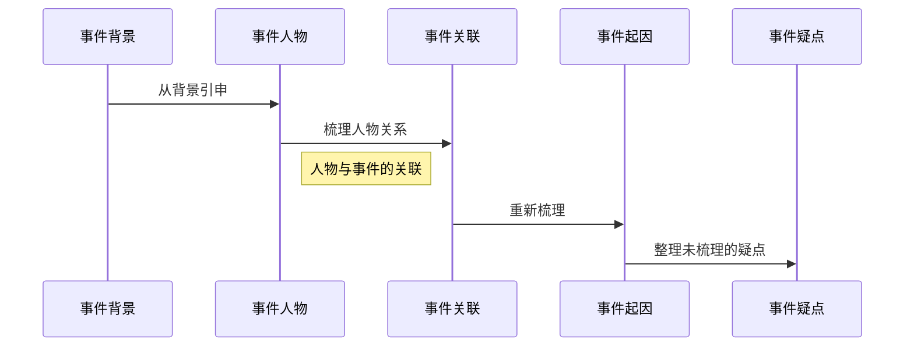

这是一个 **{ADV}(Adventure) Game** 的系统设定，该设定尚未完成
可通过`目录表`来寻找你想阅览的内容
[TOC]

---

# 系统设计

## 先决条件

### 键位操作

| ->按键键位<- | ->指令及说明<- ||
| ->方向键与功能键<- | ->行动界面<- | ->菜单界面<- |
|------------- | -------------|-------------|

-><kbd>W</kbd> / <kbd>S</kbd> / <kbd>A</kbd> / <kbd>D</kbd><- | ->向 **上 / 下 / 左 / 右** 移动<- |
-><kbd>J</kbd> / <kbd>K</kbd><- | ->**确认 / 取消** 对话或选项<br>**拿起＆使用 / 收回** 道具<-|
-><kbd>L</kbd> / <kbd>I</kbd><- |->快捷 **道具栏** / 快捷 **菜单栏** <- |
-><kbd>M</kbd><- | ->打开或关闭 **地图** 界面<- |
-><kbd>Esc</kbd><- | ->弹出或取消 **设置 / 存档** 界面<- |
-><kbd>Tab</kbd><- | -> 打开或关闭 **日记** 界面<- |
-><kbd>Q</kbd> / <kbd>P</kbd><- | ->界面 **左页** 翻动 / 界面 **右页** 翻动<- |

-><kbd>Shift</kbd><- | ->切换角色 **移动状态**<- |
-><kbd>Ctrl</kbd><- | ->**跳过** 对话或剧情<- |
-><kbd>Space</kbd><- | ->剧情大纲 **提示**<- |
-><kbd>Enter</kbd><- | -> 同 <kbd>J</kbd> 键<- |
-><kbd>Delete</kbd><- | -> 同 <kbd>K</kbd> 键<- |
[键位设计]

### 属性概述

并不是单纯的调查解谜，其中也有探索冒险元素
在进行人物的操作时有会有某些限制条件
人物有以下数值：

- **生命值	*Health Point***

> 大家都知道的 **HP** ，HP为零进入 Dead End
> 一般情况下不会出现，特殊剧情如探索时会限制角色行动

- **精力值	*Action Point***

> 简称 **AP** ，角色的每次行动都会减少AP
> 例如进行 推理解谜 和 耗费体力的行动 时会消耗AP
> AP为零角色无法进行除休息以外的行动，需休息或利用道具回复AP

- **疲劳度	*Fatigue***

> 简称 **FTG** ，属于隐藏数值，与AP成反比
> 消耗AP的同时也在累积FTG，AP回复后FTG减少
> 如一直不回复AP累积FTG会影响角色的行动成功率

---

### 日历系统

#### 简要说明
游戏时间采用 日历型
整体剧情分为 **日常线** 与 **故事线** 两大环节，其实就是 支线 与 主线
日历上的每一天都会依次进行
不论日常线有无发生，到达了故事线剧情总会延顺下去
在 **故事线** 的发展中 **有可能会因为种种原因直接进入 BAD END** ，且会影响到 日常线中的某些对话
但 **日常线** 发生的事件不会影响主线和结局，只会使 与NPC的日常对话 产生细微变化

#### 流程样图

```flow

st1=>start: 进入主线时间点
st2=>start: 该章主线结束
e1=>end: 进入下一章主线时间点
e2=>end: 游戏结束
op1=>operation: 进入日常时间点
op2=>operation: 进行日常
cond1=>condition: 是否满足剧情发展条件
cond2=>condition: 是否跳过日常

st1->cond1->st2->op1->cond2->st1
cond1(yes)->st2
cond1(no)->e2
cond2(yes)->e1
cond2(no)->op2->e1

```
#### 时序关系

```sequence!
故事线->日常线: 有影响
Note right of 日常线: 日常线可跳过
日常线-->故事线: 无影响
```
## 任务系统

### 日常线

日常是某次主线环节之后的空档期
可随意进行主线剧情外的事：

-  培养与其他 关键NPC 的 好感：
	-  送礼
	-  聊天
-  可 获得某些道具 的日常活动：
	-  购物
	-  小游戏
-  做支线任务：
	-  可获得某些道具的小任务
	-  NPC 好感任务
-  什么都不做直接进入主线 或者 跳过日常

道具的用途：

- 赠送给 NPC
- 可凭借特殊道具触发 NPC特殊对话
- 收藏观赏（汗

日常线 的任务会跟随游戏日期的不同而变换，有些 关键NPC 的剧情需蹲点进行
日常任务并非强制性，而且剧情与主线并无多少关联，到了主线当天之前没有完成的支线任务会自动放弃
如果对 NPC之间的故事 无兴趣可 跳过日常 直接进入主线

### 故事线

故事线的剧情随着玩家的探索进度而逐步进行
在主线中还会有额外的系统

每个主线章节 进行到最后的总结会用 **推理解谜** 的系统：
推理出的结果就是该章节的结局，章节之间是互相关联影响的
根据前面章节的结局会影响之后的主线剧情
进行最终推理时会进行 **逻辑推理** 环节
进行逻辑推理需 **调查主线剧情相关资料** 才能进行
每个环节都能调查获得 该章节的部分主线资料，资料集齐后进入 “Deadline” 可进入该章节的最终推理。
逻辑推理的关键点由以下线索构成：

> - 事件背景
> - 事件人物
> - 事件关联
> - 事件起因
> - 事件疑点



最终推理中如出现推理死角则会减少大部分AP强制重新推理
AP为零强制退出逻辑推理
不同的推理方式会得出不同的推理结论
推理完成得出结论后即可完成该章主线

---

## 好感系统

主角可以对身边的 关系人 提升好感以**解锁** 该人物特有的**好感剧情** 和 **日常对话**

关系列表可以在菜单界面查看

好感度的提升有三种：


- 主线剧情中的选项					*如选择错误会减少好感*
- 该人物好感度剧情的选项		*如选择错误会减少好感*
- 赠送该人物喜欢的物品			*每个主线环节可赠送一次*

礼物的获得可以在 空置时间 进行 日常生活支线 或者 其他日常休闲事件 获得，每个主线环节只能赠送一次

有喜欢的东西也有讨厌的东西，赠送讨厌的东西会减好感，人物因 好感度的高低 在 主线剧情 和 日常对话 中对主角的态度也会有所不同

每个人物好恶的东西各有不同，可以从 剧情对话 好感对话 日常调查 中得知

赠送既不喜欢也不讨厌的礼物不会增减好感，有的道具很难入手，请调查后再赠送以免浪费道具